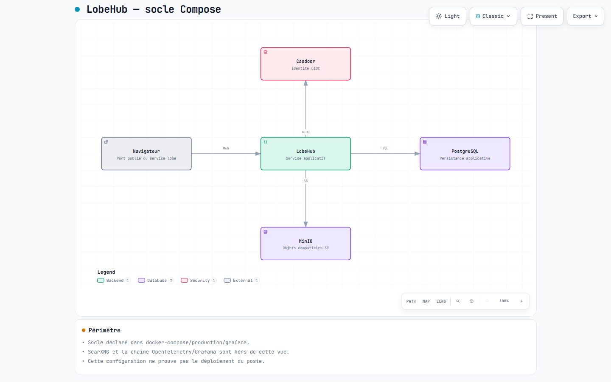

# LobeHub — socle Compose

[Carte HTML](architecture.html) · [Source JSON](architecture.archify.json) · [Preuve de validation](acceptance.json)



Télécharger le HTML et l’ouvrir dans un navigateur. GitHub montre le code HTML et ne lance pas le lecteur. Textes français, interface fixe et langue HTML du lecteur en anglais.

## Sources vérifiées

Révision examinée : `7018c9287b01d9be82c5eeba8a90196cf8f827aa`. Cette carte décrit les sources, pas une installation en fonctionnement.

| Composant | Source | Portée |
| --- | --- | --- |
| Socle Compose | `docker-compose/production/grafana/docker-compose.yml:3-16` | Exposition des ports du service réseau partagé. |
| PostgreSQL | `docker-compose/production/grafana/docker-compose.yml:20-38` | Service de persistance. |
| MinIO | `docker-compose/production/grafana/docker-compose.yml:40-66` | Stockage objet du socle. |
| Casdoor | `docker-compose/production/grafana/docker-compose.yml:69-88` | Service identité configuré avec PostgreSQL ; cette dépendance secondaire est hors du chemin principal. |
| LobeHub | `docker-compose/production/grafana/docker-compose.yml:161-192` | Dépendances et configuration SQL, S3, SSO ; aucune valeur sensible reproduite. |

## Limites

Vue du socle Docker Compose Grafana fourni par le dépôt. Les fournisseurs de modèles, SearXNG et la chaîne de télémétrie ne sont pas développés dans cette carte. Aucun secret, fichier .env ou paramètre propre au poste n’est incorporé.

## Régénération

Utiliser Archify `2.17.0-dev.1`, révision `10722002bb8777ecb639d93c49586fae4adf3ae4`, avec Node.js ≥ 18. Depuis la racine du dépôt, remplacer `<ARCHIFY>` par le chemin du skill installé :

```text
node <ARCHIFY>/bin/archify.mjs validate architecture docs/architecture/architecture.archify.json --quality showcase --json
node <ARCHIFY>/bin/archify.mjs deliver architecture docs/architecture/architecture.archify.json docs/architecture/architecture.html --quality showcase --json
node <ARCHIFY>/bin/archify.mjs visual-check docs/architecture/architecture.html --json
```

Sous Codex Windows, préfixer les commandes avec `rtk`. Lors d’une évolution du code, actualiser les preuves et le JSON puis renouveler la validation, l’aperçu et le reçu. Archify ne devient pas une dépendance de l’application.
